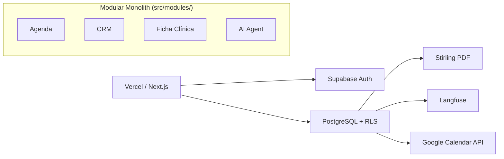

# Guía de Onboarding para Desarrolladores

Bienvenido al equipo de ingeniería de **Mi-Paciente.com**. Esta guía te llevará desde el primer contacto con el código hasta ser un contribuidor productivo.

## 1. Principal-Level Guide (TL;DR Arquitectónico)

**Core Architectural Insight:**
El sistema es un **Modular Monolith** donde la base de datos (Supabase/PostgreSQL) es el orquestador de seguridad. A diferencia de un backend tradicional, no confiamos en middleware de aplicación para el aislamiento de datos, sino en **RLS (Row Level Security)** nativo.

> **Regla de Oro:** "Si puedes hacerlo en SQL, hazlo en SQL". La lógica de multi-tenancy es invisible para el desarrollador de frontend si usa los helpers de Supabase correctamente.

### Arquitectura del Sistema

### Tradeoffs y Dirección
- **Decisión:** Usar `SECURITY DEFINER` para helpers de RLS.
- **Tradeoff:** Mayor complejidad en la depuración de políticas vs. eliminación total de la recursión infinita y mejora de rendimiento.
- **Dirección:** Mover toda la lógica de IA a **Langfuse** para permitir cambios sin deploys.

---

## 2. Zero-to-Hero Learning Path

### Parte I: Fundamentos Tecnológicos
Si vienes de otros stacks, esto es lo que necesitas saber:
- **Next.js App Router:** Usamos Server Actions para el 99% de las mutaciones.
- **Supabase vs Prisma:** No usamos ORMs tradicionales para consultas pesadas; preferimos el cliente de Supabase para aprovechar RLS.
- **Zod:** Es nuestra única fuente de verdad para validación. Si no está en un schema de Zod, no entra al servidor.

### Parte II: El Modelo de Dominio
- **Tenant = Empresa:** El `empresa_id` es el ancla de todo.
- **Contacto vs Prospecto:** Un `contacto` es un registro base; un `prospecto` es una oportunidad comercial en el CRM.
- **Agenda:** Es la fuente de verdad absoluta para disponibilidad y dinero (honorarios).

### Parte III: Configuración del Entorno
1. Clona el repo y ejecuta `npm install`.
2. Configura tu `.env.local` (pide las llaves al lead).
3. Levanta el proyecto con `npm run dev`.
4. **Validación:** Ejecuta `doc/reset_and_seed_staging.sql` en tu base de datos local para tener datos de prueba.

### Apéndice: Glosario de Términos
- **ABAC:** Control de acceso basado en atributos (permisos granulares).
- **GCal:** Google Calendar Integration.
- **Stirling:** Nuestra API de generación de PDFs.
- **Trace:** Un registro de ejecución de IA en Langfuse.

---

## Referencias Clave
- [Arquitectura y Stack](01_architecture_and_stack.md)
- [Esquema de Base de Datos](02_database_schema.md)
- [Reglas de Negocio](03_business_rules.md)
