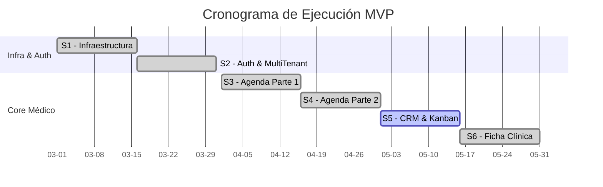

# Roadmap y Estado de Sprints

El MVP de **Mi-Paciente.com** sigue un esquema estricto e inamovible de ejecución dividido en 12 Sprints de 15 días (Deadline total de 180 Días) sobre la rama `master`.

## Estado General (Overview)

El proyecto avanza hacia la integración profunda entre el módulo de Agenda y la Ficha Clínica.

| Sprint | Período (Días) | Módulo / Core | Infra DB | Front / Server | Status |
|--------|----------------|---------------|----------|----------------|--------|
| **S1** | Días 1-15 | **Infraestructura Base** | ✅ Listo | ✅ Listo | **COMPLETADO** |
| **S2** | Días 16-30 | **Multi-Tenant + Auth + Onboarding** | ✅ Listo | ✅ Listo | **COMPLETADO** |
| **S3** | Días 31-45 | **Agenda (1ra Parte): Disposiciones y DB** | ✅ Listo | ✅ Listo | **COMPLETADO** |
| **S4** | Días 46-60 | **Agenda (2da Parte): Semanal, Mes y Nueva Cita** | ✅ Listo | ✅ Listo | **COMPLETADO** |
| **S5** | Días 61-75 | **Kanban y CRM** | 🟡 Parcial| 🟡 Parcial | **EN PROCESO** |
| **S6** | Días 76-90 | **Ficha Clínica y Firma PDFs** | ✅ Listo | ✅ Listo | **COMPLETADO (Adelantado)** |
| **S7** | Días 91-105 | **Ingesta de Lead (Omnicanal)** | ⏳ Pend. | ⏳ Pend. | Pendiente |
| **S8** | Días 106-120 | **AI Chat - Agente Part 1** | — | ⏳ Pend. | Pendiente |
| **S9** | Días 121-135 | **AI Tools - Agente Part 2** | — | ⏳ Pend. | Pendiente |
| **S10** | Días 136-150 | **Langfuse & Trazabilidad** | — | ⏳ Pend. | Pendiente |
| **S11** | Días 151-165 | **Estadísticas Dashboards** | — | ⏳ Pend. | Pendiente |
| **S12** | Días 166-180 | **Testing E2E + V-Release** | — | ⏳ Pend. | Pendiente |

## Arquitectura de Progreso Reciente

### Sprints 1–3: Base consolidada
Multi-tenant, onboarding, agenda base y fix definitivo de recursión RLS (`supabase/migrations/00050_fix_usuarios_rls_final.sql`). Google Calendar API integrado, estructura de precios por contrato formalizada.

### Sprint 4 — COMPLETADO: Agenda completa + Ficha Clínica (adelanto S6)

#### Capa de fecha/timezone (SaaS multi-país)

- Nueva columna `mpaci_empresas.timezone` (`supabase/migrations/00053_empresa_timezone.sql`) con default `'America/Santiago'`.
- Capa de fechas centralizada en `src/lib/dates.ts` usando **luxon**. Todas las consultas de rango y el posicionamiento de pills usan timezone explícita del tenant.
- Fix crítico en `reset_demo_staging()`: `timezone(zone, ts)` en lugar de `ts AT TIME ZONE zone` (`supabase/migrations/00054_fix_reset_demo_tz.sql`).

#### Vistas Semana y Mes

- `src/app/[empresa_slug]/agenda/semana/page.tsx` — rango lunes-domingo en UTC correcto, citas agrupadas server-side por día local.
- `src/app/[empresa_slug]/agenda/mes/page.tsx` — grid calendario 5-6 semanas con citas pre-filtradas.
- Componentes: `AgendaSemanaClient`, `AgendaMesClient`, `AgendaViewNav`.

#### Modal Nueva Cita funcional con RLS

- `NuevaCitaModal` recibe `timezone` y construye `fecha_inicio` con offset correcto via luxon (evita desfase UTC).
- Lista de médicos filtrada por rol: médico ve solo sí mismo, asistente ve sus asignados, admin ve todos.
- `crearCita` server action valida rol antes de insertar (médico bloqueado a su propia agenda, asistente verifica `mpaci_asignaciones_medico`).
- Fix Zod v4: campos ID usan `.min(1)` en lugar de `.uuid()` (Zod v4 RFC 4122 strict rechaza UUIDs de seed con versión 0).
- Políticas RLS INSERT y UPDATE para `mpaci_citas` (`supabase/migrations/00056_citas_rls_insert_update.sql`).

#### Loop Ficha Clínica ↔ Historial (adelanto S6)

- `mpaci_fichas_clinicas.contacto_id` agregado con backfill (`supabase/migrations/00055_fichas_clinicas_contacto_id.sql`).
- `getAntecedentesMap` ahora incluye `fichas_recientes[]` por paciente.
- Panel click-simple muestra sección **Fichas Clínicas** actualizada inmediatamente tras guardar consulta express o protocolo quirúrgico (`onSaved → refreshAntecedente`).
- `guardarConsultaRapida` INSERT incluye `contacto_id` para habilitar query directa por paciente.

#### UX/UI — Criterios de color en la agenda

- **Barra vertical izquierda:** Estado operativo + confirmación (verde=confirmada, ámbar=por confirmar, azul=realizada, rojo=no asistió, gris=cancelada).
- **Punto + texto de servicio:** Categoría (violeta=cirugía, teal=procedimiento, gris=control, índigo=consulta).

### Foco: Sprint 5

- Pipelines de ventas Kanban y CRM (`mpaci_prospectos`).
- Vista Kanban de estados de prospecto.

### Sprint 6 — Parcialmente iniciado

- Generación PDF completa (Stirling PDF) ✅ implementado en `generarProtocoloPDF`.
- Firma digital pendiente.
- Historial clínico completo por paciente (vista dedicada).

## Referencias

- Timezone por empresa (`supabase/migrations/00053_empresa_timezone.sql`)
- Fix timezone reset_demo (`supabase/migrations/00054_fix_reset_demo_tz.sql`)
- contacto_id en fichas (`supabase/migrations/00055_fichas_clinicas_contacto_id.sql`)
- RLS INSERT/UPDATE mpaci_citas (`supabase/migrations/00056_citas_rls_insert_update.sql`)
- Capa de fechas luxon (`src/lib/dates.ts`)
- Fix Final Recursión RLS (`supabase/migrations/00050_fix_usuarios_rls_final.sql:10`)
- Seed Data Staging (`doc/reset_and_seed_staging.sql:1`)
