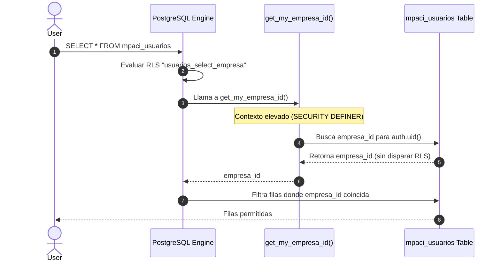

# Arquitectura de Seguridad y RLS

Este documento describe la estrategia de aislamiento de datos y seguridad en **Mi-Paciente.com**, enfocándose en el sistema de Row Level Security (RLS) de Supabase/PostgreSQL y las lecciones aprendidas durante la resolución de vulnerabilidades críticas.

## 1. Overview y Concepto Multi-Tenant

Urbamed utiliza un **aislamiento lógico** de datos (Shared Database, Shared Schema). Todas las clínicas y empresas comparten las mismas tablas físicas en PostgreSQL, pero las políticas RLS aseguran criptográficamente que un usuario solo pueda leer/escribir datos que pertenezcan a su `empresa_id` (`supabase/migrations/00011_multi_tenant_rls.sql:15`).

### ¿Por qué este modelo?
El aislamiento lógico reduce los costos de infraestructura y simplifica las migraciones de esquema en comparación con esquemas separados (schema-per-tenant). Sin embargo, traslada la responsabilidad de la seguridad a las políticas RLS y a la capa de validación de negocio.

## 2. Arquitectura de Control de Acceso

La seguridad opera en dos capas estrictas:

| Capa | Responsabilidad | Tecnología |
|---|---|---|
| **Capa de Datos (RLS)** | Aislamiento tenant y protección de filas. | PostgreSQL Row Level Security |
| **Capa de Negocio (Server Actions)** | Validación de permisos, roles y schemas. | Zod + Next.js Server Actions |

```mermaid
graph TD
    classDef default fill:#2d333b,stroke:#6d5dfc,color:#e6edf3;
    classDef sub fill:#161b22,stroke:#30363d,color:#8b949e;

    Client([Client / Browser])
    
    subgraph Capa de Negocio
        SA[Server Actions]
        Zod[Zod Validator]
    end
    
    subgraph Capa de Datos
        Supabase[Supabase API]
        RLS[PostgreSQL RLS]
        DB[(Database)]
    end

    Client -->|HTTP POST| SA
    SA -->|Valida Payload| Zod
    Zod -->|Pasa / Falla| SA
    SA -->|Query Authenticated| Supabase
    Supabase --> RLS
    RLS -->|Filtra por empresa_id| DB
    
    class Capa de Negocio,Capa de Datos sub;
```

## 3. Data Flow: El Problema de la Recursión Infinita (Postgres Error 42P17)

Durante el desarrollo del Sprint 2 y refinado en el Sprint 3, detectamos un error crítico de recursión en la tabla `mpaci_usuarios`.

### El Escenario Original (Defectuoso):
1. Una política RLS en `mpaci_usuarios` requería conocer el `empresa_id` del usuario.
2. La política realizaba un `SELECT` sobre `mpaci_usuarios` para buscar la empresa del usuario actual (`supabase/migrations/00047_fix_rls_recursion.sql:29`).
3. Ese `SELECT` activaba *nuevamente* la política de RLS.
4. **Resultado:** Bucle infinito y caída del sistema (`Postgres Error 42P17`).

### Implementación Definitiva (Migración 00050)
La solución final erradica la recursión utilizando funciones `SECURITY DEFINER` que escapan temporalmente al contexto RLS de forma controlada (`supabase/migrations/00050_fix_usuarios_rls_final.sql:10`).



### Anatomía de la Solución:

*   **Lectura de Perfil Propio:** `auth.uid() = id`. (Basado puramente en el ID de autenticación, sin consultas extra) (`supabase/migrations/00050_fix_usuarios_rls_final.sql:37`).
*   **Lectura de Compañeros:** Usa funciones estables `get_my_empresa_id()` y `get_my_rol()` (`supabase/migrations/00050_fix_usuarios_rls_final.sql:44`).

## 4. Mejores Prácticas Implementadas (RLS)

1. **Evitar Circularidad:** Nunca llames a una función que consulte la Tabla A desde una política de la Tabla A sin usar un bypass seguro.
2. **SECURITY DEFINER vs INVOKER:** Las funciones como `get_my_empresa_id()` DEBEN ser `SECURITY DEFINER` para saltarse el RLS internamente y evitar el planificador recursivo, pero están estrictamente ligadas a `auth.uid()`.
3. **Inmutabilidad Controlada:** En registros clínicos (ej. `mpaci_fichas_clinicas`), los updates están limitados a una ventana temporal de 24 horas (`ultima_edicion_en > now() - INTERVAL '24 hours'`) y solo por el usuario clínico o admin (`supabase/migrations/00050_consulta_rapida_clinica.sql:199`).

## 5. Políticas RLS para Agenda (mpaci_citas)

A partir de la migración `00056`, se han implementado políticas estrictas de `INSERT` y `UPDATE` para garantizar que la agenda sea gestionada solo por personal autorizado:

*   **Administradores:** Pueden crear y editar cualquier cita de su empresa.
*   **Médicos:** Solo pueden crear y editar citas donde ellos sean el `medico_id`.
*   **Asistentes:** Solo pueden gestionar citas de médicos a los que tengan asignados en la tabla `mpaci_asignaciones_medico`.

Esta lógica se refuerza tanto en la base de datos (RLS) como en las **Server Actions** (`crearCita`, `actualizarCita`) mediante validaciones de rol y pertenencia.

## 6. Integridad de Datos y Timezones

Con la introducción de `mpaci_empresas.timezone` (`00053`), la seguridad operativa mejora al garantizar que los cálculos de "hoy" y "mañana" se realicen siempre en el contexto local de la clínica, evitando errores de doble reserva o citas en días incorrectos debido al desfase UTC.

*   **Capa de Aplicación:** Usa `luxon` para normalizar todas las entradas de fecha antes de enviarlas a las políticas RLS.
*   **Capa de Datos:** Las funciones como `reset_demo_staging` usan `timezone(zone, timestamp)` para asegurar una conversión determinista.

## 7. Referencias

- RLS Base e Infraestructura Tenant (`supabase/migrations/00011_multi_tenant_rls.sql:1`)
- Primer intento de Fix Recursión (`supabase/migrations/00047_fix_rls_recursion.sql:25`)
- Fix Definitivo de Recursión RLS y Roles (`supabase/migrations/00050_fix_usuarios_rls_final.sql:10`)
- Ventana de Inmutabilidad 24h Clínica (`supabase/migrations/00050_consulta_rapida_clinica.sql:199`)
- Permisos por rol pre-sembrados (`doc/reset_and_seed_staging.sql:143`)
