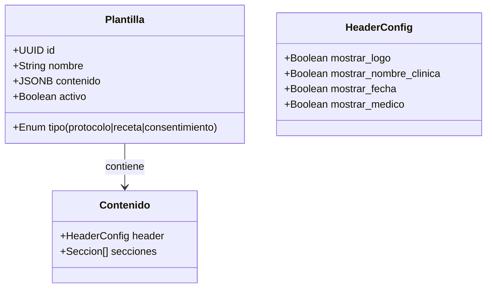

# Configuración Clínica y Plantillas

Este módulo centraliza la personalización operativa y visual de cada clínica (Tenant) dentro de **Mi-Paciente.com**. Se divide en dos grandes áreas: Infraestructura Clínica e Identidad Documental.

## 1. Identidad Corporativa e Infraestructura
Ubicado en `src/modules/configuracion/actions-clinica.ts`, gestiona los recursos físicos y servicios que habilitan la agenda médica.

### A. Datos de Clínica
Permite definir la información que aparecerá en los encabezados de los documentos generados (PDFs).
- **Logo:** Almacenado en el bucket `empresa-assets` con el patrón `{empresaId}/logo.{ext}` (src/modules/configuracion/actions-plantillas.ts:81).
- **Contacto:** Email, teléfono y dirección física por empresa.

### B. Servicios y Precios
Define el catálogo de prestaciones (`mpaci_servicios`) y su configuración económica.
- **Categorías:** consulta, evaluación, procedimiento, cirugía, control, examen.
- **Precios por Cobertura:** Permite manejar múltiples listas de precios (Fonasa, Isapre, Particular) para un mismo servicio (`mpaci_servicios_precios`).

### C. Sedes y Salas
Estructura física de la clínica (`mpaci_sucursales` y `mpaci_salas`) que permite asignar recursos específicos a cada cita para evitar colisiones de espacio.

---

## 2. Plantillas de Documentos Médicos
Implementado en el Sprint 6 para automatizar la generación de recetas, protocolos y consentimientos (`mpaci_plantillas_documentos`).

### Estructura de Datos (JSONB)
Las plantillas utilizan un esquema flexible almacenado en una columna JSONB (`contenido`), lo que permite evolucionar el diseño sin migraciones de esquema constantes.

### Flujo de Trabajo: Upsert de Plantilla
La Server Action `upsertPlantilla` (src/modules/configuracion/actions-plantillas.ts:151) valida la estructura antes de persistir en Supabase.

| Paso | Acción | Validación (Zod) |
|---|---|---|
| 1 | `assertAdminGeneral` | Verifica rol `admin_general` (actions-plantillas.ts:9) |
| 2 | Parse JSON | Convierte el string del formulario a objeto `ContenidoPlantilla` |
| 3 | `PlantillaSchema` | Valida tipos, nombres y estructura de secciones |
| 4 | `upsert` | Inserta o actualiza en `mpaci_plantillas_documentos` |
| 5 | `revalidatePath` | Purga caché de la ruta de configuración |

---

## 3. Seguridad y RLS
Toda la configuración está protegida por políticas RLS estrictas:
- **Lectura/Escritura:** Limitada a usuarios donde `empresa_id = get_my_empresa_id()`.
- **Privilegios:** Las Server Actions de este módulo invocan `assertAdminGeneral()` (src/modules/configuracion/actions-clinica.ts:8), restringiendo el acceso solo a administradores de la clínica.

## Referencias
- Tabla Plantillas: `supabase/migrations/00058_plantillas_documentos.sql`
- Lógica de Negocio: `src/modules/configuracion/actions-plantillas.ts`
- Consultas: `src/modules/configuracion/queries-plantillas.ts`
- Bucket de Assets: `storage/buckets` (empresa-assets)
